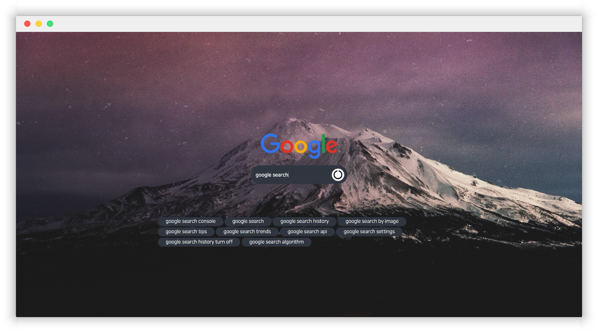

# custom google search



**좀 더 멋진 구글 검색창 프로젝트**

일반적인 검색 및 자동완성 키워드를 보여주는 웹 프로젝트입니다.

## 설치 및 시작

node.js와 npm이 설치되어 있어야 합니다.

``` bash
git clone https://github.com/ytype/custom-google-search.git
cd custom-google-search
npm instal
npm serve
```

## 기술 스택

+ vue.js

vue-cli를 기반으로 vue-auto-routing과 axios, jsonp을 사용했습니다.

+ css

css를 연습해보고자 css 프레임워크 없이 진행했습니다. [darkcode의 영상](https://www.youtube.com/watch?v=v1PeTDrw6OY&t=138s)을 참고했습니다.

반응형으로 결과를 출력할 때, desktop은 10개, tablet은 6개, mobile은 3개를 출력합니다.

## To-do

- [ ] 모바일에서 레이아웃이 조금 깨지는 문제 (구글 로고와 검색창이 겹침)
- [ ] 배경화면 사용자가 설정 가능하게 수정
- [ ] 폰트 및 검색창, 결과창의 색상을 사용자가 설정 가능하게 수정
